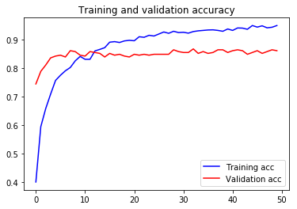
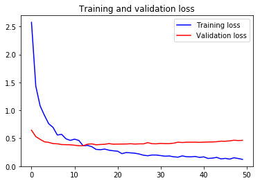

# Ikea-WebScraping-Classification

A repository to perform data collection of images using web scraping techniques to create a dataset from the IKEA website. The datatset created is then used to build a deep learning model which uses a convolutional neural network based image classifier implemented in keras to classify images into 4 categories - beds, tables, chairs and tableware.

The model successfully achieved an accuracy of about 92% on the training set and 85% on the test set.

## Contributing
1. Fork it!
2. Create your feature branch: `git checkout -b my-new-feature`
3. Commit your changes: `git commit -am 'Add some feature'`
4. Push to the branch: `git push origin my-new-feature`
5. Submit a pull request :smile: